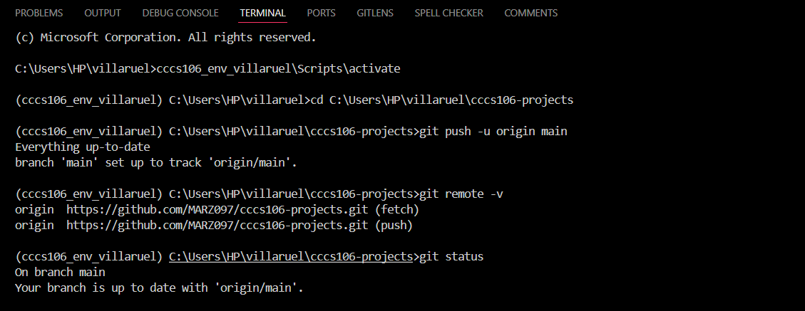
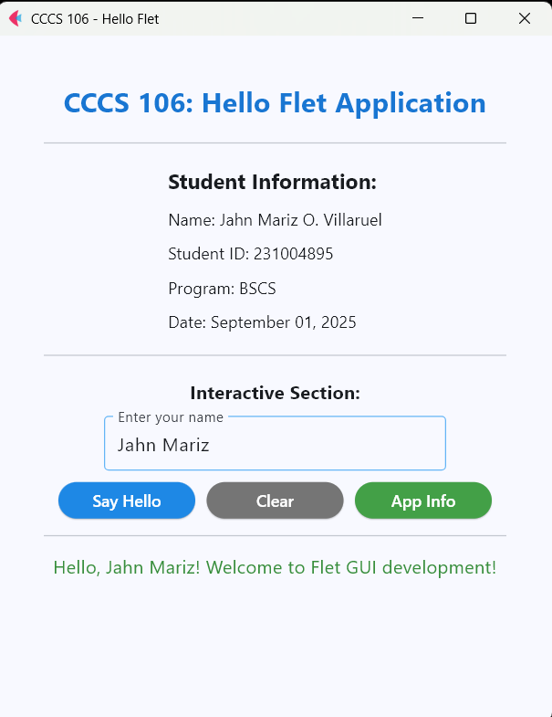
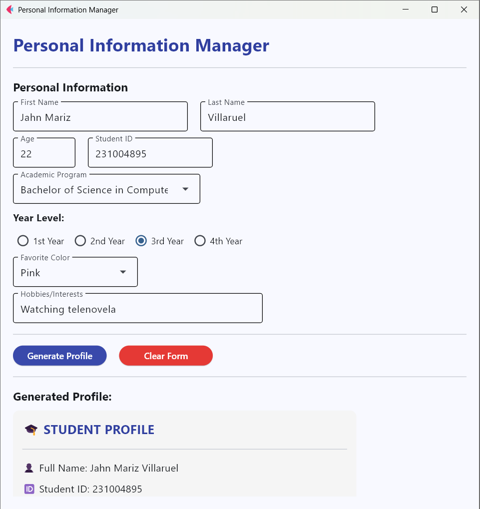

# Lab 2 Report: Git Version Control and Flet GUI Development

**Student Name:** Jahn Mariz O. Villaruel  
**Student ID:** 231004895  
**Section:** 3B  
**Date:** [Submission Date]  

---

## Git Configuration
### Repository Setup
- **GitHub Repository:** [Your repository URL]  
- **Local Repository:** ✅ Initialized and connected  
- **Commit History:** Multiple commits with descriptive messages  

### Git Skills Demonstrated
- ✅ Repository initialization and configuration  
- ✅ Adding, committing, and pushing changes  
- ✅ Branch creation and merging  
- ✅ Remote repository management  

---

## Flet GUI Applications

### 1. hello_flet.py
- **Status:** ✅ Completed  
- **Features:** Interactive greeting, student info display, dialog boxes  
- **UI Components:** Text, TextField, Buttons, Dialog, Containers  
- **Notes:** Learned how to handle events and update the page in real time.  

### 2. personal_info_gui.py
- **Status:** ✅ Completed  
- **Features:** Form inputs, dropdowns, radio buttons, profile generation  
- **UI Components:** TextField, Dropdown, RadioGroup, Containers, Scrolling  
- **Error Handling:** Input validation and user feedback  
- **Notes:** Challenging but useful for understanding form validation.  

---

## Technical Skills Developed
### Git Version Control
- Basic Git workflow (add, commit, push)  
- Branch management and merging  
- Remote repository collaboration  

### Flet GUI Development
- Layout management  
- Event handling and user interaction  
- Modern UI design principles  

---

## Challenges and Solutions
- **Challenge:** Understanding Git branching at first  
- **Solution:** Followed step-by-step Git commands and practiced merging  

- **Challenge:** Handling invalid age input in Flet  
- **Solution:** Added input validation and error dialogs  

---

## Learning Outcomes
- Gained confidence in Git version control  
- Understood collaborative workflow with branches  
- Learned basics of Flet 0.28.3 for GUI development  
- Practiced creating interactive apps with user input  

---

## Screenshots
 
  

---

## Future Enhancements
- Add a **calculator GUI** for more practice  
- Improve design with more colors and themes  
- Store profile data into a file (JSON or CSV)  
